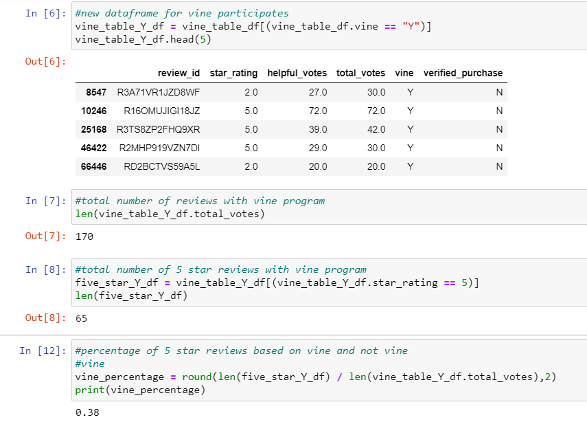
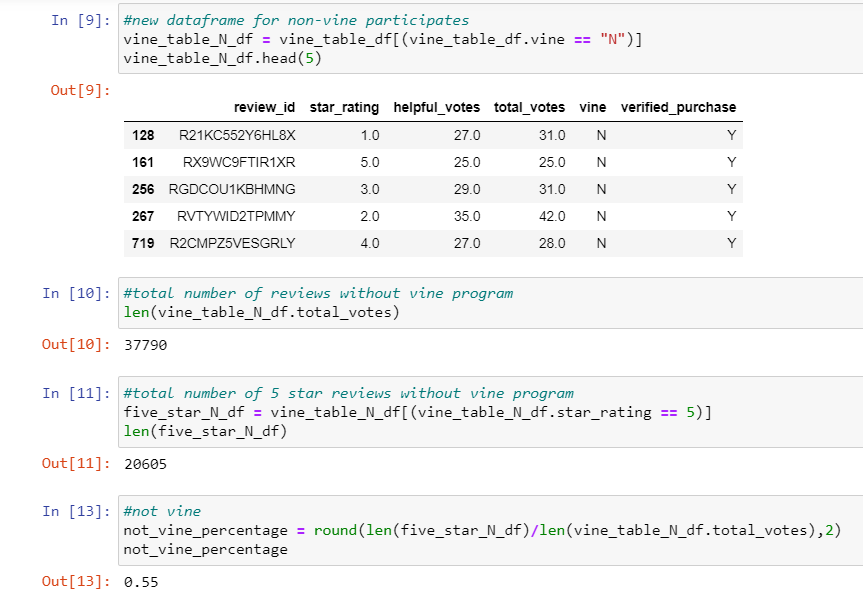

# Amazon_Vine_Analysis

## Purpose
This analysis aims to evaluate the affects of the paid review program that Amazon called the Vine reviews, specifically if it affects the frequency of five star reviews for pet products. 

## Results

### Vine reviews
There were a total of 170 Vine reviews, and out of that 170 reviews, 65 of the reviews were five stars. That is 38% of reviews were five stars within the Vine program. 

### Non Vine Reviews
In contrast, there were a total of 37790 reviews outside of the Vine program, and out of that 37790 reviews, 20605 reviews were five stars. That is 55% of reviews were five starts outside of the Vine program. 

## Summary

### No Positvity Bias
Based on this limited analysis, there is no obvious bias towards positive reviews due to the Vine program. Since the percentage of five star reviews within the Vine program were lower than the non Vine program, it does not appear being paid to write reviews, generated only positive reviews. 

### Additional analysis
To provide a more analytical perspective, I would further filter the data and compare only the products that Vine members reviewed to non Vine member reviews. I would also recommend analyzing the data within the same period of time to ensure the quality of the item had minimmal variance. Lastly, I would also ensure the reviews are from individuals with verified purchase to further ensure the robustness of the results. 